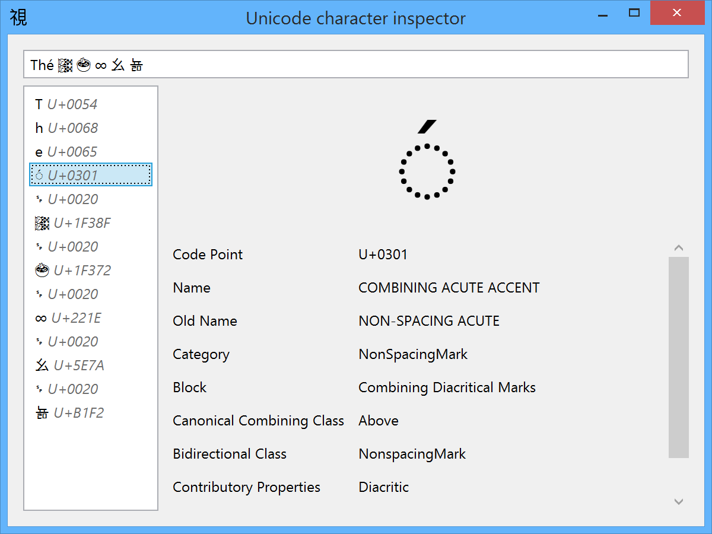

Unicode Character Inspector & .NET Unicode Information Library
==============================================================

[](https://dev.azure.com/goldencrystal/UnicodeInformation/_build/latest?definitionId=1&branchName=master)

Summary
-------
This projects has two parts.
One is a library, providing access to some of the data contained in the Unicode Character Database by the means of a portable .NET assembly.
The other, is a small WPF application allowing to inspect the Unicode code points composing a specified text.

Version of Unicode supported
----------------------------
Unicode 10.0.0
Emoji 5.0

Using the Unicode Character Inspector application
-------------------------------------------------
Simply launch the application, then type or paste some text in the text box on the top of the window.
The code points will be displayed in the list on the left side. Select one of them to display the associated information in the bottom-right pane.


Breaking changes from versions 1.x to 2.x
-----------------------------------------
UnicodeRadicalStrokeCount.StrokeCount is now of type System.SByte instead of type System.Byte.

Compiling and using the project
-------------------------------
### Using the UnicodeInformation library
Grab the latest version of the package on NuGet: https://www.nuget.org/packages/UnicodeInformation/.
Once the library is installed in your project, you will find everything you need in the System.Unicode namespace.

Let's see a simple example:

```csharp
using System;
using System.Text;
using System.Unicode;

namespace Example
{
	internal static class Program
	{
		private static void Main()
		{
			Console.OutputEncoding = Encoding.Unicode;
			PrintCodePointInfo('A');
			PrintCodePointInfo('∞');
			PrintCodePointInfo(0x1F600);
		}

		private static void PrintCodePointInfo(int codePoint)
		{
			var charInfo = UnicodeInfo.GetCharInfo(codePoint);
			Console.WriteLine(UnicodeInfo.GetDisplayText(charInfo));
			Console.WriteLine("U+" + codePoint.ToString("X4"));
			Console.WriteLine(charInfo.Name ?? charInfo.OldName);
			Console.WriteLine(charInfo.Category);
		}
	}
}
```
This example shows a few usages of the library. It gets information on a specific code point, queries the library for the text to display for the specific character (usually the character itself), and displays the character's name and category.

### Details
In its current state, the project is written in C# 6, compilable by [Roslyn](http://roslyn.codeplex.com/), and targets the .NET 4.5 framework.
The core of the project, UnicodeInformation.dll, is a portable class library usable for either regular .NET or Windows 8 applications.
This library includes a subset of the official [Unicode Character Database](http://www.unicode.org/Public/UCD/latest/) stored in a custom file format.

### Included Properties
#### From UCD
* Name
* General_Category
* Canonical_Combining_Class
* Bidi_Class
* Decomposition_Type
* Decomposition_Mapping
* Numeric_Type (See also kAccountingNumeric/kOtherNumeric/kPrimaryNumeric. Those will set Numeric_Type to Numeric.)
* Numeric_Value
* Bidi_Mirrored
* Unicode_1_Name
* Simple_Uppercase_Maping
* Simple_Lowercase_Mapping
* Simple_Titlecase_Mapping
* Name_Alias
* Block
* ASCII_Hex_Digit
* Bidi_Control
* Dash
* Deprecated
* Diacritic
* Extender
* Hex_Digit
* Hyphen
* Ideographic
* IDS_Binary_Operator
* IDS_Trinary_Operator
* Join_Control
* Logical_Order_Exception
* Noncharacter_Code_Point
* Other_Alphabetic
* Other_Default_Ignorable_Code_Point
* Other_Grapheme_Extend
* Other_ID_Continue
* Other_ID_Start
* Other_Lowercase
* Other_Math
* Other_Uppercase
* Pattern_Syntax
* Pattern_White_Space
* Quotation_Mark
* Radical
* Soft_Dotted
* STerm
* Terminal_Punctuation
* Unified_Ideograph
* Variation_Selector
* White_Space
* Lowercase
* Uppercase
* Cased
* Case_Ignorable
* Changes_When_Lowercased
* Changes_When_Uppercased
* Changes_When_Titlecased
* Changes_When_Casefolded
* Changes_When_Casemapped
* Alphabetic
* Default_Ignorable_Code_Point
* Grapheme_Base
* Grapheme_Extend
* Grapheme_Link
* Math
* ID_Start
* ID_Continue
* XID_Start
* XID_Continue
* Unicode_Radical_Stroke (This is actually kRSUnicode from the Unihan database)
* Code point cross references extracted from NamesList.txt

NB: The UCD property ISO_Comment will never be included since this one is empty in all new Unicode versions.

#### From Unihan
* kAccountingNumeric
* kOtherNumeric
* kPrimaryNumeric
* kRSUnicode
* kDefinition
* kMandarin
* kCantonese
* kJapaneseKun
* kJapaneseOn
* kKorean
* kHangul
* kVietnamese
* kSimplifiedVariant
* kTraditionalVariant

### Regenerating  the data
The project UnicodeInformation.Builder takes cares of generating a file named ucd.dat. This file contains Unicode data compressed by .NET's deflate algorithm, and should be included in UnicodeInformation.dll at compilation.
